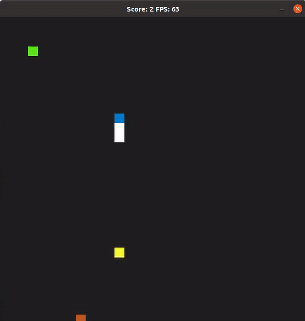
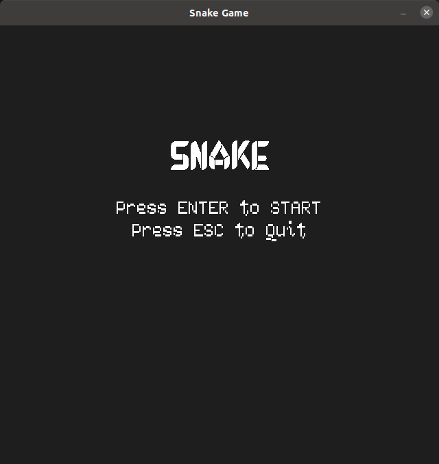
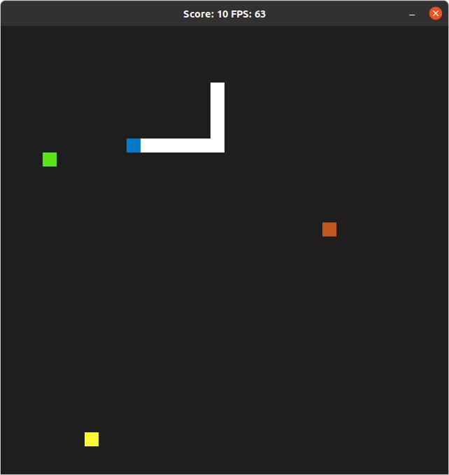
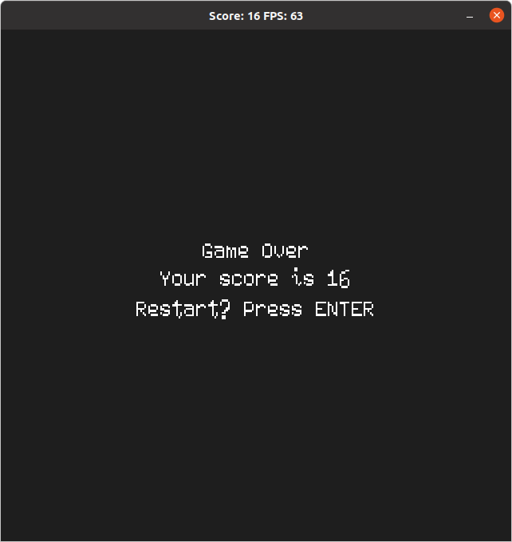

# Snake Game

This is my submisson for Capstone project in the [Udacity C++ Nanodegree Program](https://www.udacity.com/course/c-plus-plus-nanodegree--nd213).



## Dependencies for Running Locally
* cmake >= 3.7
  * All OSes: [click here for installation instructions](https://cmake.org/install/)
* make >= 4.1 (Linux, Mac), 3.81 (Windows)
  * Linux: make is installed by default on most Linux distros
  * Mac: [install Xcode command line tools to get make](https://developer.apple.com/xcode/features/)
  * Windows: [Click here for installation instructions](http://gnuwin32.sourceforge.net/packages/make.htm)
* SDL2 >= 2.0
  * All installation instructions can be found [here](https://wiki.libsdl.org/Installation)
  >Note that for Linux, an `apt` or `apt-get` installation is preferred to building from source. 
* True-Type-Fonts require TTF header files in additional to the SDL library.
```bash
  sudo apt-get install libsdl2-ttf-dev
```
* gcc/g++ >= 5.4
  * Linux: gcc / g++ is installed by default on most Linux distros
  * Mac: same deal as make - [install Xcode command line tools](https://developer.apple.com/xcode/features/)
  * Windows: recommend using [MinGW](http://www.mingw.org/)


## Basic Build Instructions

1. Clone this repo.
2. Make a build directory in the top level directory: `mkdir build && cd build`
3. Compile: `cmake .. && make`
4. Run it: `./SnakeGame`.

>Note: CMake throws the following errors, you may ignore :
```bash
-- Could NOT find SDL2TTF (missing: SDL2TTF_INCLUDE_DIRS) 
-- Could NOT find SDL2MIXER (missing: SDL2MIXER_INCLUDE_DIRS) 
```

## Scope & Implementations

Original fork implements the basic game and challenges you to understand and develop further features. For my flavour of the Snake Game, I selected some features that added more intuitiveness and made it a whole game.
1. Add <b>Boosts & Penalties</b> to add dynamism.
2. Play game for longer/continue playing without exiting.
3. Add Time based challenges.
4. Add game music.
5. Make all game features accessible inside the window.

I have successfully implemented everything except the 3rd feature which later came to realize wasn't that fun to implement.

### Boosts and Penalties
In the game Green blocks are food, they grow the length of the snake and also increase speed of movement. Brown block is the Morgue, which when met will kill the snake and the game will end. Yellow blocks give a chance to decrease the speed of snake by a little and reduce length of the snake while still keeping the score. As the snake keeps eating the food the speed will be difficult to manage so the player can use this as a way to keep them in the game. Speed reduction is set at 1/10th right now.

### Play game for longer/continue playing without exiting.
I have implemented a Start and End screen that way player can choose to continue to play or exit. End screen displays the score and pressing `ENTER` key allows player to play again. At any point in the game if player presses '`ESC` key quits the game.

### Game music
When playing the game song "Bit of Hope" is played in the background. Implemented using the SDL_Mixer. 

### Make all game features accessible inside the window
Developed a Start and End Game screen. Using SDL_TTF imported True-Type-Fonts and displays the game name and presents control options to the player.

### Expected Behavior
On game launch Press `ENTER` key to play, `ESC` key to quit.
The game starts and spawns the Snake Head(Blue), a Food block(Green), a Lemon(Shrinking Food - Yellow) & a Morgue(Kills - Brown). Player to use the keyboard arrow keys to change the direction of the snake travel.
* Eating Green colored block scores a point and increases the length and speed of the snake.
* Eating Yellow colored block scores no points and decreases the length of the snake.
* Eating Brown colored block kills the snake and ends the game.

If the snake goes to the Brown block/Morgue snake dies, or if you circle back the snake head to snake body snake will die.

On the Game End screen player score is displayed and can press `ENTER` key to play again or press `ESC` key to quit the game.

<p>



</p>

## CC Attribution-ShareAlike 4.0 International


Shield: [![CC BY-SA 4.0][cc-by-sa-shield]][cc-by-sa]

This work is licensed under a
[Creative Commons Attribution-ShareAlike 4.0 International License][cc-by-sa].

[![CC BY-SA 4.0][cc-by-sa-image]][cc-by-sa]

[cc-by-sa]: http://creativecommons.org/licenses/by-sa/4.0/
[cc-by-sa-image]: https://licensebuttons.net/l/by-sa/4.0/88x31.png
[cc-by-sa-shield]: https://img.shields.io/badge/License-CC%20BY--SA%204.0-lightgrey.svg

"A bit of Hope" is Royalty Free Music from : https://www.fesliyanstudios.com/

Game fonts are form https://www.fontspace.com. 'Debrosee-ALPnL' for Game Title, and 'SummerPixel' for game menu.
